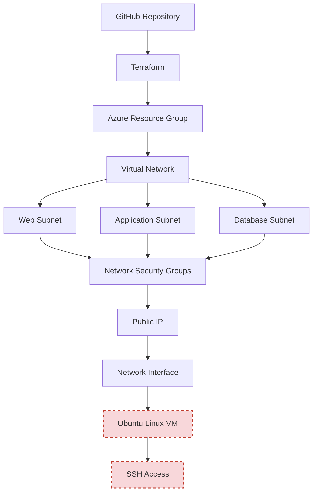

# Architecture — Phase 3: Azure Enterprise Network

## Overview

This document describes the target Azure network architecture provisioned by this Terraform project: a segmented, three-tier virtual network protected by tier-specific Network Security Groups, fronted by a public-facing compute layer.

## Architecture Diagram

> **Legend:** Nodes outlined in red with dashed borders (`Ubuntu Linux VM`, `SSH Access`) represent components that are **fully coded and validated** but were **not successfully provisioned** due to an Azure regional capacity restriction (`SkuNotAvailable`). All other components deployed and validated successfully.

## Layer-by-Layer Breakdown

### 1. Source Control & IaC Layer
- **GitHub Repository** — stores the Terraform configuration under version control.
- **Terraform** — reads the configuration, builds a dependency graph, and orchestrates resource creation via the AzureRM provider.

### 2. Foundational Layer
- **Azure Resource Group** — logical container scoping all resources for lifecycle management (single unit for cost tracking and deletion).
- **Virtual Network** — defines the private address space (e.g., `10.0.0.0/16`) for the environment.

### 3. Network Segmentation Layer
- **Web Subnet** — hosts internet-facing resources (e.g., `10.0.1.0/24`).
- **Application Subnet** — hosts internal application logic, reachable only from the Web tier (e.g., `10.0.2.0/24`).
- **Database Subnet** — most restricted tier, reachable only from the Application tier (e.g., `10.0.3.0/24`).

### 4. Security Layer
- **Network Security Groups** — one per subnet, each with explicit inbound/outbound rules:
  - Web NSG: allows HTTP (80), HTTPS (443), SSH (22, restricted source)
  - Application NSG: allows traffic only from the Web subnet on the application port
  - Database NSG: allows SQL (1433) only from the Application subnet
- **NSG Associations** — bind each NSG to its corresponding subnet in code.

### 5. Connectivity Layer
- **Public IP** — static, internet-routable address for inbound access to the VM.
- **Network Interface (NIC)** — attaches the Public IP and the Web subnet's private address space to the VM.

### 6. Compute Layer *(blocked at deployment)*
- **Ubuntu Linux VM** — application host, configured for SSH key-based authentication.
- **SSH Access** — administrative access channel, restricted by the Web NSG's SSH rule.

## Deployment Status Summary

| Layer | Status |
|---|---|
| Resource Group | ✅ Deployed |
| Virtual Network | ✅ Deployed |
| Subnets (x3) | ✅ Deployed |
| NSGs + Rules | ✅ Deployed |
| NSG Associations | ✅ Deployed |
| Public IP | ✅ Deployed |
| Network Interface | ✅ Deployed |
| Linux Virtual Machine | ⛔ Blocked — `SkuNotAvailable` (Azure regional capacity) |

See the [Troubleshooting section of the README](../README.md#-troubleshooting) and [`LESSONS_LEARNED.md`](LESSONS_LEARNED.md) for the full root-cause analysis.
