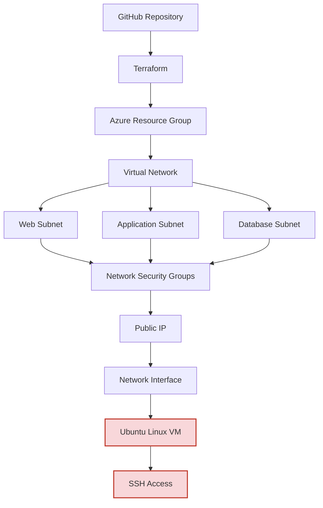
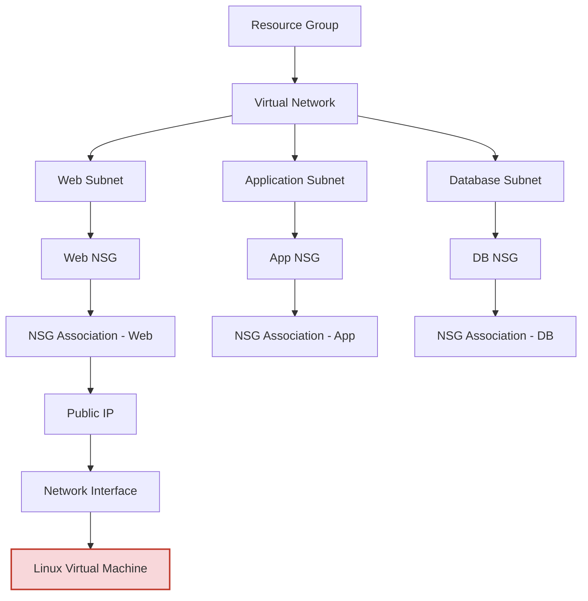

# Phase 3 — Azure Enterprise Network 🌐

**Enterprise-grade Azure network foundation provisioned with Terraform — implementing a segmented three-tier network architecture with security-group-enforced traffic control.**


---

## 📋 Table of Contents

1. [Project Overview](#-project-overview)
2. [Objectives](#-objectives)
3. [Technologies Used](#-technologies-used)
4. [Azure Services Used](#-azure-services-used)
5. [Folder Structure](#-folder-structure)
6. [Features](#-features)
7. [Architecture](#-architecture)
8. [Terraform Dependency Graph](#-terraform-dependency-graph)
9. [Terraform Workflow](#-terraform-workflow)
10. [Deployment Process](#-deployment-process)
11. [Screenshots](#-screenshots)
12. [Troubleshooting](#-troubleshooting)
13. [Lessons Learned](#-lessons-learned)
14. [Future Improvements](#-future-improvements)
15. [Skills Demonstrated](#-skills-demonstrated)
16. [License](#-license)
17. [Author](#-author)

---

## 🧭 Project Overview

**Phase 3: Azure Enterprise Network** is an Infrastructure-as-Code project that provisions a segmented, security-conscious virtual network foundation in Microsoft Azure using Terraform. The project models a typical **three-tier enterprise architecture** — Web, Application, and Database tiers — each isolated into its own subnet and governed by dedicated Network Security Groups (NSGs).

This project is part of an ongoing series of hands-on Azure infrastructure labs designed to build production-relevant cloud networking and Infrastructure-as-Code skills, progressing from foundational resource provisioning toward enterprise-scale, security-hardened deployments.

> **Deployment status:** The network layer (Resource Group, VNet, Subnets, NSGs, Security Rules, Public IP, NIC) is fully written, validated, and plan-tested. The compute layer (Ubuntu Linux VM) is fully coded and ready to deploy, but provisioning was blocked in the target region by an Azure capacity constraint (`SkuNotAvailable`). See [Troubleshooting](#-troubleshooting) for full details — this was **not** a code defect.

---

## 🎯 Objectives

- Design a segmented virtual network that mirrors real-world enterprise tiering (Web / App / Database).
- Enforce least-privilege network access using per-tier Network Security Groups and explicit security rules.
- Provision all infrastructure declaratively and repeatably using Terraform.
- Practice Terraform resource referencing, implicit dependency management, and computed attributes.
- Document infrastructure decisions, failures, and troubleshooting in a way that reflects real cloud engineering practice — including transparently reporting a regional capacity blocker rather than concealing it.

---

## 🛠️ Technologies Used

| Category | Tool / Technology |
|---|---|
| Cloud Provider | Microsoft Azure |
| IaC Tooling | Terraform |
| Version Control | Git |
| Repository Hosting | GitHub |
| Compute OS | Ubuntu Linux (VM) |
| Remote Access | SSH |
| Provider Plugin | `azurerm` (Terraform AzureRM Provider) |

---

## ☁️ Azure Services Used

- **Azure Resource Group** — logical container for all provisioned resources
- **Azure Virtual Network (VNet)** — private network address space for the environment
- **Azure Subnets** — Web, Application, and Database tier segmentation
- **Network Security Groups (NSGs)** — stateful traffic filtering per subnet
- **NSG Associations** — binding NSGs to their respective subnets
- **Azure Public IP** — external endpoint for inbound access
- **Network Interface (NIC)** — virtual NIC attaching the VM to the Web subnet
- **Azure Virtual Machine (Ubuntu Linux)** — application compute layer (code complete, deployment pending capacity)

---

## 📁 Folder Structure

```
Phase-3-Azure-Enterprise-Network/
│
├── providers.tf            # Terraform + AzureRM provider configuration and backend
├── variables.tf            # Input variable declarations (region, CIDR ranges, VM size, etc.)
├── network.tf               # Resource Group, VNet, and Subnet definitions
├── security.tf               # NSGs, security rules, and NSG-subnet association              # Public IP, NIC, and Linux Virtual Machine
├── outputs.tf                 # Exported values (VNet ID, subnet IDs, public IP, etc.)
├── terraform.tfvars           # Environment-specific variable values (gitignored in production)
├── .gitignore                  # Excludes state files, .terraform/, and secrets from version control
├── LICENSE                      # MIT License
├── README.md                    # Project documentation (this file)
│
├── docs/
│   ├── ARCHITECTURE.md           # Azure architecture diagram + narrative
│   ├── TERRAFORM_DEPENDENCIES.md # Terraform resource dependency diagram
│   ├── LESSONS_LEARNED.md         # Deep-dive technical retrospective     # Q&A prep tied to this project              # GitHub banner design specification
│   └── ARCHITECTURE_IMAGE_SPEC.md    # diagrams.net / Visio recreation spec
│
└── images/                   # Repository banner (Canva/Figma export)
    ├── architecture-diagram.png        # Rendered Azure architecture diagram
    ├── terraform-plan-output.png        # Screenshot: terraform plan
    └── terraform-apply-output.png        # Screenshot: terraform apply
```

### Why each file exists

| File | Purpose |
|---|---|
| `providers.tf` | Pins the Terraform and `azurerm` provider versions so the configuration behaves consistently across machines and CI runners. |
| `variables.tf` | Centralizes all configurable inputs (region, address spaces, VM size, admin username) so the module is reusable across environments without editing resource code. |
| `network.tf` | Groups all foundational networking resources — Resource Group, VNet, and the three Subnets — for clear separation of concerns. |
| `security.tf` | Isolates all security-related resources (NSGs, rules, associations) so access-control logic is auditable in one place. |
| `compute.tf` | Contains the Public IP, NIC, and Virtual Machine — the resources that depend on the network layer being created first. |
| `outputs.tf` | Surfaces key resource attributes (IDs, IP addresses) for use by other modules, CI pipelines, or manual verification. |
| `terraform.tfvars` | Supplies actual values for declared variables, kept separate from logic so environments can differ without touching `.tf` files. |
| `.gitignore` | Prevents state files, provider caches, and credentials from being committed to version control. |
| `docs/` | Keeps in-depth technical writing (architecture, lessons learned, interview prep) out of the top-level README to keep it scannable. |
| `images/` | Stores diagrams and CLI screenshots referenced throughout the documentation. |

---

## ✨ Features

- ✅ Fully modular, readable Terraform configuration split by concern (network, security, compute)
- ✅ Three-tier subnet segmentation (Web / Application / Database)
- ✅ Dedicated NSG per tier with explicit allow rules (HTTP, HTTPS, SSH, SQL)
- ✅ NSG-to-subnet associations enforced in code, not manually in the portal
- ✅ Public IP + NIC provisioned and wired to the compute layer
- ✅ Clean `terraform plan` output with zero configuration errors
- ✅ Transparent documentation of a real-world Azure regional capacity failure
- ✅ Enterprise-style documentation suitable for team onboarding or handoff

---

## 🏗️ Architecture



> ⚠️ **Deployment Note:** The `Ubuntu Linux VM` node above represents fully validated, deploy-ready Terraform code. Actual provisioning was blocked by an Azure `SkuNotAvailable` regional capacity error at apply time. The network and security layers (Resource Group → NSGs) deployed and validated successfully. See the full breakdown in [`docs/ARCHITECTURE.md`](docs/ARCHITECTURE.md) and [Troubleshooting](#-troubleshooting).

---

## 🔗 Terraform Dependency Graph



This graph reflects the **implicit dependency chain** Terraform builds from resource references (e.g., a subnet referencing `azurerm_resource_group.main.name`, a NIC referencing the subnet ID). Terraform uses this graph to determine creation order and parallelize non-dependent resources automatically. Full breakdown in [`docs/TERRAFORM_DEPENDENCIES.md`](docs/TERRAFORM_DEPENDENCIES.md).

---

## ⚙️ Terraform Workflow

```bash
# 1. Initialize the working directory and download providers
terraform init

# 2. Validate configuration syntax
terraform validate

# 3. Format code to canonical style
terraform fmt -recursive

# 4. Preview planned changes
terraform plan -out=tfplan

# 5. Apply the approved plan
terraform apply tfplan

# 6. Tear down when finished (cost control)
terraform destroy
```

---

## 🚀 Deployment Process

1. **Clone the repository**
   ```bash
   git clone https://github.com/<your-username>/Phase-3-Azure-Enterprise-Network.git
   cd Phase-3-Azure-Enterprise-Network
   ```
2. **Authenticate to Azure**
   ```bash
   az login
   az account set --subscription "<subscription-id>"
   ```
3. **Configure variables** in `terraform.tfvars` (region, address space, admin username, SSH public key path).
4. **Run the standard Terraform workflow** (`init` → `validate` → `plan` → `apply`) shown above.
5. **Verify resources** in the Azure Portal or via `az resource list --resource-group <rg-name>`.
6. **Connect over SSH** once the VM is deployed:
   ```bash
   ssh azureuser@<public-ip-address>
   ```
7. **Destroy resources** after testing to avoid ongoing cost.

---

## 🖼️ Screenshots

> Add screenshots to `images/` and reference them below once captured.

| Screenshot | Description |
|---|---|
| `images/terraform-plan-output.png` | `terraform plan` showing the full, error-free resource plan |
| `images/terraform-apply-output.png` | `terraform apply` output for the successfully deployed network layer |
| `images/azure-portal-resources.png` | Azure Portal view of the deployed Resource Group and its resources |
| `images/architecture-diagram.png` | Rendered architecture diagram (see [Architecture Image Spec](docs/ARCHITECTURE_IMAGE_SPEC.md)) |

---

## 🧩 Troubleshooting

### Issue: `SkuNotAvailable` on Virtual Machine creation

**Symptom:**
```
Error: creating Linux Virtual Machine: compute.VirtualMachinesClient#CreateOrUpdate:
Failure sending request: StatusCode=409 -- Original Error:
Code="SkuNotAvailable" Message="The requested VM size for resource
'Following SKUs have failed for Capacity Restrictions: <vm-size>' is
currently not available in location '<region>'."
```

**Root cause:** This is an **Azure regional capacity constraint**, not a Terraform configuration error. Azure allocates finite hardware capacity per VM SKU, per region, per availability zone. When a region is under high demand for a given SKU, new deployments of that SKU can be temporarily blocked — independent of subscription quota or code correctness.

**Verification that the code is correct:**
- `terraform validate` passes with no errors
- `terraform plan` generates a complete, accurate execution plan for the VM resource
- All upstream dependencies (Public IP, NIC, Subnet) deployed successfully
- The failure occurs specifically at the Azure control-plane provisioning step, after Terraform's configuration has already been accepted

**Resolution paths (documented, not yet re-attempted in this environment):**
1. Deploy to an alternate Azure region with available capacity for the target SKU.
2. Select an alternate VM size/series with capacity in the current region.
3. Request a capacity increase via an Azure support ticket.
4. Retry deployment later, as regional capacity fluctuates over time.

This issue and its resolution options are documented in more depth in [`docs/LESSONS_LEARNED.md`](docs/LESSONS_LEARNED.md).

---

## 📚 Lessons Learned

A full technical retrospective — covering Terraform references, computed attributes, state file behavior, resource dependency resolution, SSH key handling, Azure networking concepts, and regional capacity troubleshooting — is available in [`docs/LESSONS_LEARNED.md`](docs/LESSONS_LEARNED.md).

**Highlights:**
- Terraform builds its dependency graph from **implicit references** between resources, not from file order.
- **Computed attributes** (like a NIC's private IP) aren't known until after `apply`, which affects how outputs and downstream resources must be written.
- Cloud deployment failures are not always code failures — **regional capacity constraints** are an operational reality that production teams plan around (multi-region strategies, retry logic, SKU flexibility).
- Documenting a failure honestly and thoroughly is itself a demonstration of engineering maturity.

---

## 🔮 Future Improvements

- [ ] Re-deploy the VM in a secondary region (`eastus2`, `westus2`) once regional capacity allows
- [ ] Parameterize VM SKU selection with a fallback list to auto-retry across sizes
- [ ] Add Azure Bastion for secure access instead of an exposed public SSH endpoint
- [ ] Introduce Terraform remote state (Azure Storage backend) with state locking
- [ ] Add CI/CD via GitHub Actions (`terraform fmt`, `validate`, `plan` on PR)
- [ ] Integrate Azure Policy for guardrail enforcement
- [ ] Add a Terraform module structure for reusability across environments
- [ ] Introduce `tfsec` / `checkov` static security scanning in CI

---

## 🧠 Skills Demonstrated

- Infrastructure as Code with Terraform (HCL syntax, resource blocks, variables, outputs)
- Azure Virtual Networking (VNets, subnets, CIDR planning, address space design)
- Network security design (NSGs, security rule prioritization, least-privilege access)
- Terraform state and dependency management
- Cloud troubleshooting and root-cause analysis under real deployment constraints
- Technical documentation and enterprise-style project communication
- Git-based version control workflow


## 👤 Author

Benjamin Sherif Malik


<p align="center"><i>Part of an ongoing Azure Infrastructure-as-Code learning series — Phase 3 of N.</i></p>
