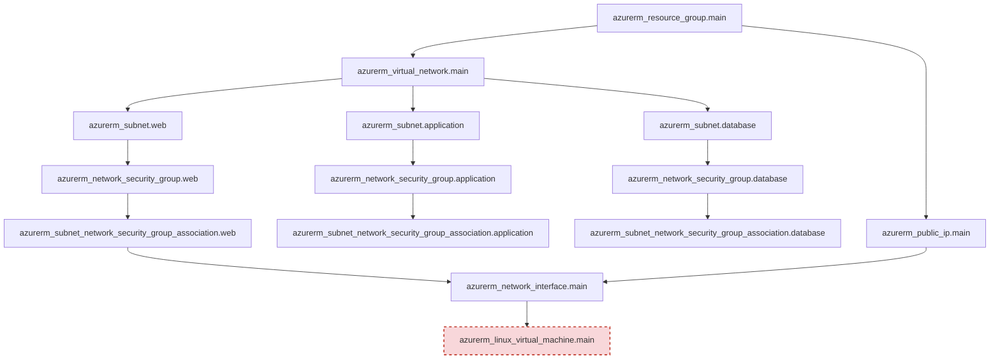

# Terraform Resource Dependency Graph

## Purpose

Terraform does not execute resources in the order they appear in `.tf` files. Instead, it parses **references between resource attributes** to build a directed acyclic graph (DAG), then creates resources in the order the graph requires — parallelizing anything that has no interdependency.

## Dependency Diagram



## How Each Dependency Is Formed

| Resource | Depends On | Because |
|---|---|---|
| `azurerm_virtual_network.main` | Resource Group | References `azurerm_resource_group.main.name` and `.location` |
| `azurerm_subnet.*` (x3) | Virtual Network | References `azurerm_virtual_network.main.name` and the resource group |
| `azurerm_network_security_group.*` (x3) | Resource Group | References `.location` and `.name` of the Resource Group |
| `azurerm_subnet_network_security_group_association.*` | Subnet + NSG | Explicitly references both `subnet_id` and `network_security_group_id` |
| `azurerm_public_ip.main` | Resource Group | References `.location` and `.name` |
| `azurerm_network_interface.main` | Subnet Association + Public IP | References the Web subnet ID (via its `ip_configuration` block) and the Public IP ID — Terraform infers it must wait until the NSG association exists to avoid a race condition on the subnet |
| `azurerm_linux_virtual_machine.main` | Network Interface | References `azurerm_network_interface.main.id` in `network_interface_ids` |

## Key Terraform Concepts Illustrated

- **Implicit dependencies**: Terraform infers ordering automatically from `resource.attribute` references — no manual `depends_on` was needed for most of this graph.
- **Explicit dependencies**: Used sparingly (e.g., ensuring the NSG association completes before the NIC attaches to the subnet) where implicit inference alone wasn't sufficient to guarantee correct ordering.
- **Computed attributes**: Values like the NIC's `private_ip_address` or the VM's `id` are unknown until after `apply` — Terraform marks these as "known after apply" during `plan`.
- **Parallelization**: The three subnets, and their associated NSGs, have no dependency on each other and are created concurrently by Terraform's graph-walking engine, reducing total deployment time.
- **Graph termination**: Because the Linux VM sits at the bottom of the graph with the most dependencies, it is — correctly — the last resource Terraform attempts to create, and the first to fail if any upstream issue exists at the Azure control-plane level (as occurred here with `SkuNotAvailable`).

## Inspecting the Graph Yourself

```bash
terraform graph | dot -Tpng > graph.png
```

This renders Terraform's actual internal dependency graph (requires [Graphviz](https://graphviz.org/)) and can be compared against the diagram above.
